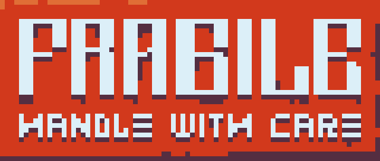
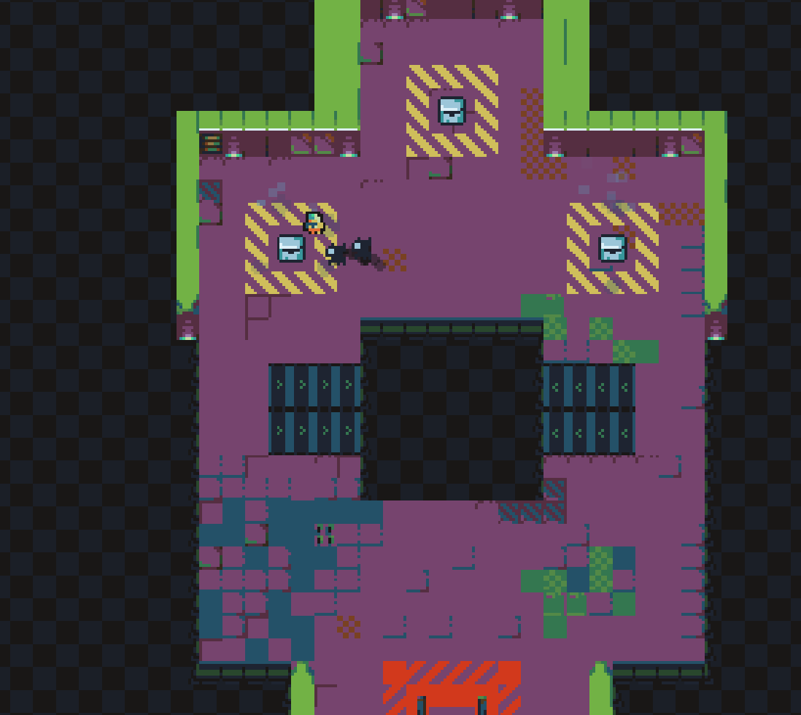
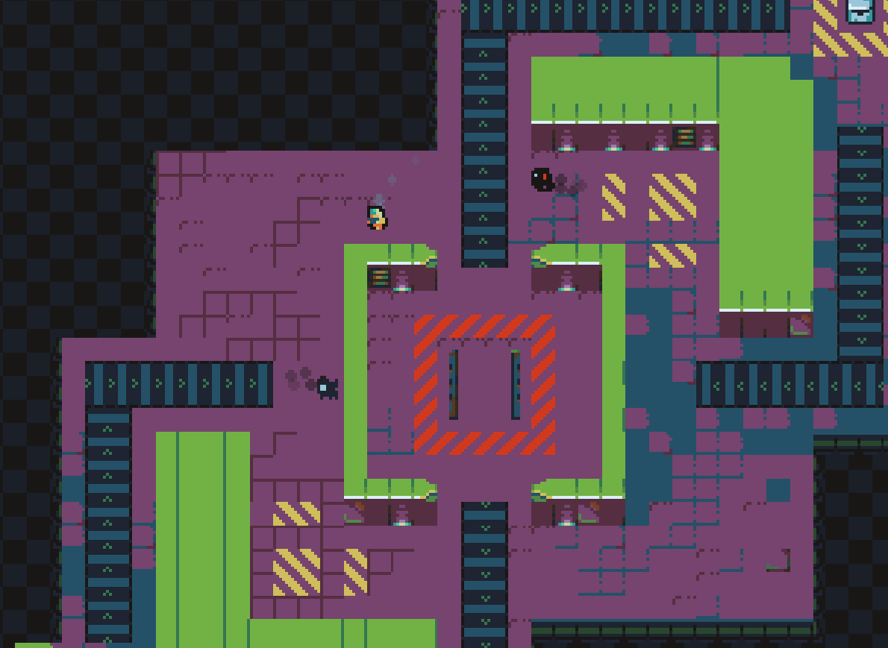

# FRAGILE: handle with care

A Topdown action-focused combat game where you use packages to fight.

[Ludum Dare 53 entry](https://ldjam.com/events/ludum-dare/53/fragile-handle-with-care)
[Itch.io page](https://jakubtomsu.itch.io/fragile-handle-with-care)

## Credits
### Team
- Jakub Tomšů - programming ([Twitter](https://twitter.com/jakubtomsu_))
- Dylan Seibert - audio ([Website](https://dot.cards/dylanseibert))

### Free Assets
- [8x8 rougelike tileset by Scut](https://scut.itch.io/7drl-tileset-2018)
- [Crosver font](https://befonts.com/crosver-font.html)
- [Things Digital font](https://befonts.com/things-digital-font.html)

## Screenshots

